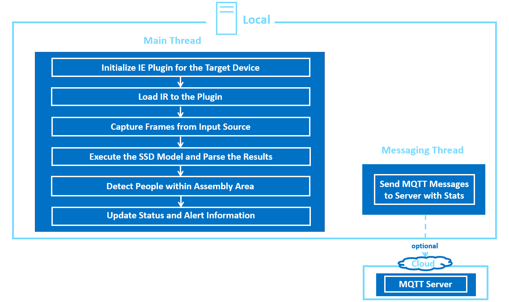
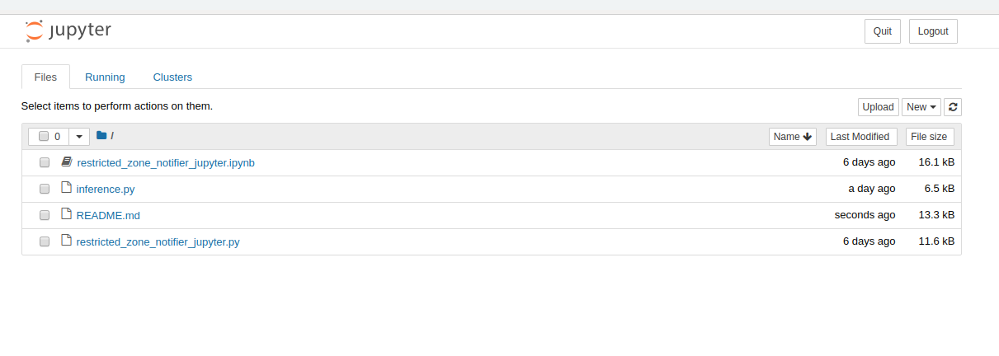
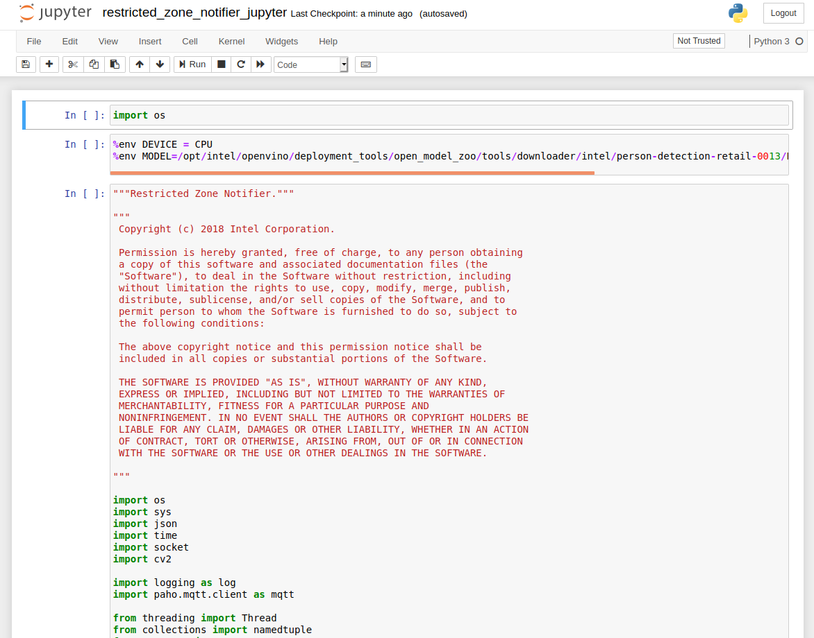

# Restricted Zone Notifier

| Details            |              |
|-----------------------|---------------|
| Target OS:            |  Ubuntu\* 16.04 LTS   |
| Programming Language: |  Python* 3.5 |
| Time to Complete:    |  30 min     |


## What it does
This application is designed to detect the humans present in a predefined selected assembly line area. If the people enters the marked assembly area, it raises the alert and sends through mqtt. It is intended to demonstrate how to use CV to improve assembly line safety for human operators and factory workers.

## Requirements

### Hardware

* 6th to 8th generation Intel® Core™ processors with Iris® Pro graphics or Intel® HD Graphics
 
### Software

* [Ubuntu\* 16.04 LTS](http://releases.ubuntu.com/16.04/)

* OpenCL™ Runtime package

  *Note*: We recommend using a 4.14+ kernel to use this software. Run the following command to determine your kernel version:
 
      uname -a
  
* Intel® Distribution of OpenVINO™ toolkit 2019 R3 Release
* Jupyter* Notebook v5.7.0

## How It works

This restricted zone notifier application uses the Inference Engine included in the Intel® Distribution of OpenVINO™ toolkit and the Intel® Deep Learning Deployment Toolkit. A trained neural network detects people within a marked assembly area, which is designed for a machine mounted camera system. It sends an alert if there is at least one person detected in the marked assembly area. The user can select the area coordinates either via command line parameters, or once the application has been started, they can select the region of interest (ROI) by pressing `c` key. This will pause the application, pop up a separate window on which the user can drag the mouse from the upper left ROI corner to whatever the size they require the area to cover. By default the whole frame is selected. Worker safety and alert signal data are sent to a local web server using the Paho MQTT C client libraries.
The program creates two threads for concurrency:

- Main thread that performs the video i/o, processes video frames using the trained neural network.
- Worker thread that publishes MQTT messages.<br>

<br>
**Architectural Diagram**

## Setup

### Get the code

Steps to clone the reference implementation:
```
sudo apt-get update && sudo apt-get install git
git clone https://gitlab.devtools.intel.com/reference-implementations/restricted-zone-notifier-python.git
``` 
### Install Intel® Distribution of OpenVINO™ toolkit

Refer to https://software.intel.com/en-us/articles/OpenVINO-Install-Linux for more information about how to install and setup the Intel® Distribution of OpenVINO™ toolkit.

You will need the OpenCL™ Runtime package if you plan to run inference on the GPU. It is not mandatory for CPU inference.

### Other dependencies
#### Mosquitto*
Mosquitto is an open source message broker that implements the MQTT protocol. The MQTT protocol provides a lightweight method of carrying out messaging using a publish/subscribe model.

### Which model to use
This application uses the [person-detection-retail-0013](https://docs.openvinotoolkit.org/2019_R3/_models_intel_person_detection_retail_0013_description_person_detection_retail_0013.html)
 Intel® pre-trained model, that can be accessed using the **model downloader**. The **model downloader** downloads the __.xml__ and __.bin__ files that will be used by the application.
 
To install the dependencies of the RI and to download the **person-detection-retail-0013** Intel® model, run the following command:

    cd <path_to_the_restricted-zone-notifier-python_directory>
    ./setup.sh 

The model will be downloaded inside the following directory:
 
    /opt/intel/openvino/deployment_tools/open_model_zoo/tools/downloader/intel/person-detection-retail-0013/

### The Config File

The _resources/config.json_ contains the path to the videos that will be used by the application.
The _config.json_ file is of the form name/value pair, `video: <path/to/video>`

Example of the _config.json_ file:

```
{

    "inputs": [
	    {
            "video": "videos/video1.mp4"
        }
    ]
}
```

### Which Input video to use

The application works with any input video. Find sample videos for object detection [here](https://github.com/intel-iot-devkit/sample-videos/).  

For first-use, we recommend using the [worker-zone-detection](https://github.com/intel-iot-devkit/sample-videos/blob/master/worker-zone-detection.mp4) video.The video is automatically downloaded to the `resources/` folder.
For example: <br>
The config.json would be:

```
{

    "inputs": [
	    {
            "video": "sample-videos/worker-zone-detection.mp4"
        }
    ]
}
```
To use any other video, specify the path in config.json file

### Using the Camera instead of video

Replace the path/to/video in the _resources/config.json_  file with the camera ID, where the ID is taken from the video device (the number X in /dev/videoX).   

On Ubuntu, list all available video devices with the following command:

```
ls /dev/video*
```

For example, if the output of above command is /dev/video0, then config.json would be::

```
{

    "inputs": [
	    {
            "video": "0"
        }
    ]
}
```

## Setup the environment
You must configure the environment to use the Intel® Distribution of OpenVINO™ toolkit one time per session by running the following command:

    source /opt/intel/openvino/bin/setupvars.sh -pyver 3.5

__Note__: This command needs to be executed only once in the terminal where the application will be executed. If the terminal is closed, the command needs to be executed again.

## Run the application on Jupyter*

* Go to the _restricted-zone-notifier-python_ directory and open the Jupyter notebook by running the following command:

      cd <path_to_the_restricted-zone-notifier-python_directory>/Jupyter

      jupyter notebook

    **Note:** Before running the application on the FPGA, set the environment variables and  program the AOCX (bitstream) file.<br>

    Set the Board Environment Variable to the proper directory:

    ```
    export AOCL_BOARD_PACKAGE_ROOT=/opt/intel/openvino/bitstreams/a10_vision_design_sg<#>_bitstreams/BSP/a10_1150_sg<#>
    ```
    **NOTE**: If you do not know which version of the board you have, please refer to the product label on the fan cover side or by the product SKU: Mustang-F100-A10-R10 => SG1; Mustang-F100-A10E-R10 => SG2 <br>

    Set the Board Environment Variable to the proper directory:
    ```
    export QUARTUS_ROOTDIR=/home/<user>/intelFPGA/18.1/qprogrammer
    ```
    Set the remaining environment variables:
    ```
    export PATH=$PATH:/opt/altera/aocl-pro-rte/aclrte-linux64/bin:/opt/altera/aocl-pro-rte/aclrte-linux64/host/linux64/bin:/home/<user>/intelFPGA/18.1/qprogrammer/bin
    export INTELFPGAOCLSDKROOT=/opt/altera/aocl-pro-rte/aclrte-linux64
    export LD_LIBRARY_PATH=$LD_LIBRARY_PATH:$AOCL_BOARD_PACKAGE_ROOT/linux64/lib
    export CL_CONTEXT_COMPILER_MODE_INTELFPGA=3
    source /opt/altera/aocl-pro-rte/aclrte-linux64/init_opencl.sh
    ```
    **NOTE**: It is recommended to create your own script for your system to aid in setting up these environment variables. It will be run each time you need a new terminal or restart your system.

    The bitstreams for HDDL-F can be found under the `/opt/intel/openvino/bitstreams/a10_vision_design_sg<#>_bitstreams/` directory.<br><br>To program the bitstream use the below command:<br>
    ```
    aocl program acl0 /opt/intel/openvino/bitstreams/a10_vision_design_sg<#>_bitstreams/2019R3_PV_PL1_FP11_RMNet.aocx
    ```

    For more information on programming the bitstreams, please refer the [link](https://software.intel.com/en-us/articles/OpenVINO-Install-Linux-FPGA#inpage-nav-11).

**Follow the steps to run the code on Jupyter:**



1. Click on **New** button on the right side of the Jupyter window.

2. Click on **Python 3** option from the drop down list.

3. In the first cell type **import os** and press **Shift+Enter** from the keyboard.

4. Export the below environment variables in second cell of Jupyter and press **Shift+Enter**.<br>
       
       %env DEVICE = CPU
       %env CPU_EXTENSION = /opt/intel/openvino/inference_engine/lib/intel64/libcpu_extension_sse4.so 
       %env MODEL=/opt/intel/openvino/deployment_tools/open_model_zoo/tools/downloader/intel/person-detection-retail-0013/FP32/person-detection-retail-0013.xml
       
5. User can set threshold for the detection (PROB_THRESHOLD),
   number of seconds between data updates to MQTT server (RATE), also "off-limits" area coordinates (POINTX, POINTY, WIDTH, HEIGHT)
   . Export these environment variables as given below if required else skip this step. If user skips this step, these values are set to default values.<br>
   
       %env PROB_THRESHOLD = 0.4
       %env RATE = 1.00
       %env POINTX = 429
       %env POINTY = 101
       %env WIDTH = 619
       %env HEIGHT = 690
       
    To run the application on sync mode, export the environment variable **%env FLAG = sync**. By default, the application runs on async mode.
   
6.  Copy the code from **restricted_zone_notifier_jupyter.py** and paste it in the next cell and press **Shift+Enter**.

7.  Once the video runs, user can select an area to be used as the "off-limits" area by pressing the `c` key. A new window will open showing a still image from the video capture device. Drag the mouse from top left corner to cover an area on the plane and once done (a blue rectangle is drawn) press `ENTER` or `SPACE` to proceed with monitoring.

8. Alternatively, code can be run in the following way.

    i. Click on the **restricted_zone_notifier_jupyter.ipynb** file in the Jupyter notebook window.
    
    ii. Click on the **Kernel** menu and then select **Restart & Run All** from the drop down list.
    
    iii. Click on Restart and Run All Cells.



**NOTE:**

1. To run the application on **GPU**:
     * With the floating point precision 32 (FP32), change the **%env DEVICE = CPU** to **%env DEVICE = GPU**<br>
       **FP32**: FP32 is single-precision floating-point arithmetic uses 32 bits to represent numbers. 8 bits for the magnitude and 23 bits for the precision. For more information, [click here](https://en.wikipedia.org/wiki/Single-precision_floating-point_format)<br>

     * With the floating point precision 16 (FP16), change the environment variables as given below:<br>
        
           %env DEVICE = GPU
           %env MODEL=/opt/intel/openvino/deployment_tools/open_model_zoo/tools/downloader/intel/person-detection-retail-0013/FP16/person-detection-retail-0013.xml
       **FP16**: FP16 is half-precision floating-point arithmetic uses 16 bits. 5 bits for the magnitude and 10 bits for the precision. For more information, [click here](https://en.wikipedia.org/wiki/Half-precision_floating-point_format)

     * **CPU_EXTENSION** environment variable is not required.

2. To run the application on **Intel® Neural Compute Stick**: 
      * Change the **%env DEVICE = CPU** to **%env DEVICE = MYRIAD**
      * The Intel® Neural Compute Stick can only run FP16 models. Hence change the environment variable for the model as shown below. <br>
      
            %env MODEL=/opt/intel/openvino/deployment_tools/open_model_zoo/tools/downloader/intel/person-detection-retail-0013/FP16/person-detection-retail-0013.xml
      * **CPU_EXTENSION** environment variable is not required.

3. To run the application on **Intel® Movidius™ VPU**:
      * Change the **%env DEVICE = CPU** to **%env DEVICE = HDDL**
      * The  Intel® Movidius™ VPU can only run FP16 models. Hence change the environment variable for the model as shown below. <br>
      
            %env MODEL=/opt/intel/openvino/deployment_tools/open_model_zoo/tools/downloader/intel/person-detection-retail-0013/FP16/person-detection-retail-0013.xml
      * **CPU_EXTENSION** environment variable is not required.

4. To run the application on **Intel® Arria® 10 FPGA**:
      * Change the **%env DEVICE = CPU** to **%env DEVICE = HETERO:FPGA,CPU**
      * With the **floating point precision 16 (FP16)**, change the path of the model in the environment variable **MODEL** as given below:<br>

            %env MODEL=/opt/intel/openvino/deployment_tools/open_model_zoo/tools/downloader/intel/person-detection-retail-0013/FP16/person-detection-retail-0013.xml
      * Export the **CPU_EXTENSION** environment variable as shown below:

            %env CPU_EXTENSION = /opt/intel/openvino/inference_engine/lib/intel64/libcpu_extension_sse4.so

5. **%env RATE** should always have float values (e.g. 0.02, 1.00, etc.,).

6. To run the application on multiple devices: <br>
   For example:
      * Change the **%env DEVICE = CPU** to **%env DEVICE = MULTI:CPU,GPU,MYRIAD**
      * With the **floating point precision 16 (FP16)**, change the path of the model in the environment variable **MODEL** as given below: <br>
            %env MODEL=/opt/intel/openvino/deployment_tools/open_model_zoo/tools/downloader/intel/person-detection-retail-0013/FP16/person-detection-retail-0013.xml
      * **%env CPU_EXTENSION=/opt/intel/openvino/deployment_tools/inference_engine/lib/intel64/libcpu_extension_avx2.so**<br>


## Machine to Machine Messaging with MQTT

If you wish to use a MQTT server to publish data, you should set the following environment variables on a terminal before opening the jupyter notebook:

    export MQTT_SERVER=localhost:1883
    export MQTT_CLIENT_ID=cvservice

Change the `MQTT_SERVER` to a value that matches the MQTT server you are connecting to.

You should change the `MQTT_CLIENT_ID` to a unique value for each monitoring station, so that you can track the data for individual locations. For example:

    export MQTT_CLIENT_ID=zone1337

If you want to monitor the MQTT messages sent to your local server, and you have the `mosquitto` client utilities installed, you can run the following command in a new terminal while executing the code:

    mosquitto_sub -h localhost -t Restricted_zone_python
