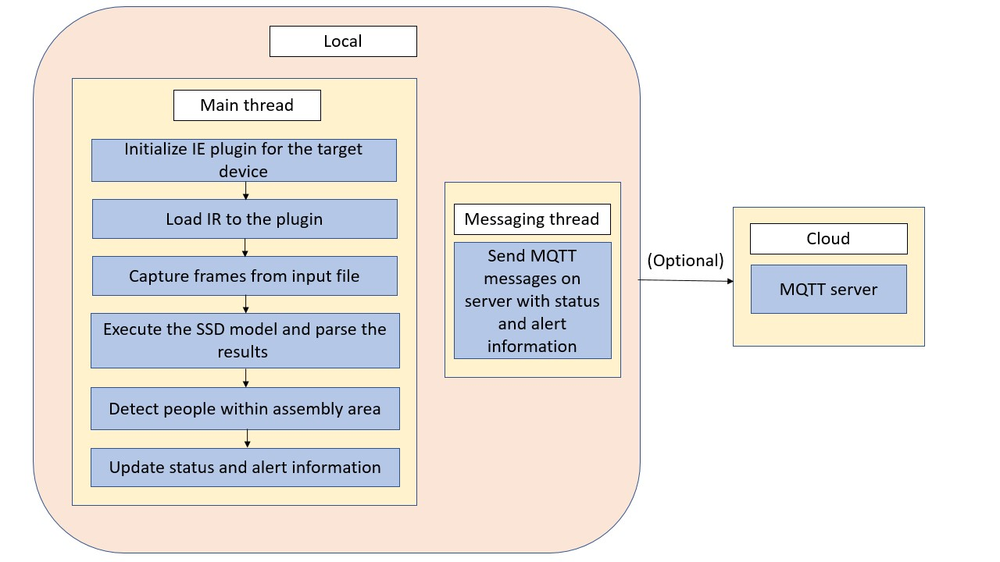

# Restricted Zone Notifier

| Details            |              |
|-----------------------|---------------|
| Target OS:            |  Ubuntu\* 16.04 LTS   |
| Programming Language: |  Python* 3.5 |
| Time to Complete:    |  30 min     |


## Introduction

This restricted zone notifier application uses the Inference Engine included in the Intel® Distribution of OpenVINO™ toolkit and the Intel® Deep Learning Deployment Toolkit. A trained neural network detects people within a marked assembly area, which is designed for a machine mounted camera system. It sends an alert if there is at least one person detected in the marked assembly area. The user can select the area coordinates either via command line parameters, or once the application has been started, they can select the region of interest (ROI) by pressing `c` key. This will pause the application, pop up a separate window on which the user can drag the mouse from the upper left ROI corner to whatever the size they require the area to cover. By default the whole frame is selected. Worker safety and alert signal data are sent to a local web server using the Paho MQTT C client libraries.

This sample is intended to demonstrate how to use Inference Engine included in the Intel® Distribution of OpenVINO™ toolkit and the Intel® Deep Learning Deployment Toolkit to improve assembly line safety for human operators and factory workers.

The DNN model used in this application is an Intel® optimized model that is part of the Intel® Distribution of OpenVINO™ toolkit. You can find it here:

 `/opt/intel/computer_vision_sdk_2018.5.445/deployment_tools/intel_models/person-detection-retail-0013`

The program creates two threads for concurrency:

- Main thread that performs the video i/o, processes video frames using the trained neural network.
- Worker thread that publishes MQTT messages.



## Requirements

### Hardware

* 6th to 8th generation Intel® Core™ processor with Iris® Pro graphics or Intel® HD Graphics
 
### Software

* [Ubuntu\* 16.04 LTS](http://releases.ubuntu.com/16.04/)

* OpenCL™ Runtime package

  *Note*: We recommend using a 4.14+ kernel to use this software. Run the following command to determine your kernel version:
  ```
    uname -a
  ```

* Intel® Distribution of OpenVINO™ toolkit 2018 R5 release toolkit

## Setup

### Install Intel® Distribution of OpenVINO™ toolkit

Refer to https://software.intel.com/en-us/articles/OpenVINO-Install-Linux for more information about how to install and setup the Intel® Distribution of OpenVINO™ toolkit.

You will need the OpenCL™ Runtime package if you plan to run inference on the GPU. It is not mandatory for CPU inference.

### Install Python* dependencies

 ```sudo apt install python3-pip```

 ```sudo apt-get install mosquitto mosquitto-clients```

 ```pip3 install paho-mqtt```

 ```pip3 install numpy```

 ```pip3 install jupyter```

 
## Setup the environment

You must configure the environment to use the Intel® Distribution of OpenVINO™ toolkit one time per session by running the following command:
```
source /opt/intel/computer_vision_sdk_2018.5.445/bin/setupvars.sh -pyver 3.5
```

## Run the application

Start by changing the current directory to wherever you have git cloned the application code. For example:
```
cd <path_to_the_restricted-zone-notifyer-python_directory>
```
To see a list of the various options:
```
python3 main.py --help
```

### Sample Video

 You can download sample video by running following commands.
```
 mkdir resources
 cd resources
 wget https://github.com/intel-iot-devkit/sample-videos/raw/master/worker-zone-detection.mp4
 cd ..
```

### Running on the CPU
When running Intel® Distribution of OpenVINO™ toolkit Python applications on the CPU,
the CPU extension library is required. This can be found at /opt/intel/computer_vision_sdk/deployment_tools/inference_engine/lib/ubuntu_16.04/intel64/ after building the Intel® Distribution of OpenVINO™ toolkit examples.

Though by default application runs on CPU, this can also be explicitly specified by  ```-d CPU``` command-line argument:
```
python3 main.py -m /opt/intel/computer_vision_sdk_2018.5.445/deployment_tools/intel_models/person-detection-retail-0013/FP32/person-detection-retail-0013.xml -l /opt/intel/computer_vision_sdk_2018.5.445/inference_engine/lib/ubuntu_16.04/intel64/libcpu_extension_sse4.so -d CPU -i resources/worker-zone-detection.mp4
```
You can select an area to be used as the "off-limits" area by pressing the `c` key once the program is running. A new window will open showing a still image from the video capture device. Drag the mouse from left top corner to cover an area on the plane and once done (a blue rectangle is drawn) press `ENTER` or `SPACE` to proceed with monitoring.

Once you have selected the "off-limits" area the coordinates will be displayed in the terminal window like this:
```
Assembly Area Selection: -x=429 -y=101 -ht=619 -w=690
```

You can run the application using those coordinates by using the `-x`, `-y`, `-ht`, and `-w` flags to select the area.

For example:
 ```
python3 main.py -m /opt/intel/computer_vision_sdk_2018.5.445/deployment_tools/intel_models/person-detection-retail-0013/FP32/person-detection-retail-0013.xml -l /opt/intel/computer_vision_sdk_2018.5.445/inference_engine/lib/ubuntu_16.04/intel64/libcpu_extension_sse4.so -x 429 -y 101 -ht 619 -w 690 -i resources/worker-zone-detection.mp4 
```

If you do not select or specify an area, by default the entire window is selected as the off limits area.


### Running on the GPU
To run on the integrated Intel® GPU in 32 bit mode, use the ```-d GPU``` command-line argument:
```
python3 main.py -m /opt/intel/computer_vision_sdk_2018.5.445/deployment_tools/intel_models/person-detection-retail-0013/FP32/person-detection-retail-0013.xml -i resources/worker-zone-detection.mp4 -d GPU
```
To use GPU in 16 bit mode, use the following command.
```
python3 main.py -m /opt/intel/computer_vision_sdk_2018.5.445/deployment_tools/intel_models/person-detection-retail-0013/FP16/person-detection-retail-0013.xml -i resources/worker-zone-detection.mp4 -d GPU
```

### Running on the Intel® Neural Compute Stick
To run on the Intel® Neural Compute Stick, use the ```-d MYRIAD``` command-line argument:
```
python3 main.py -m /opt/intel/computer_vision_sdk_2018.5.445/deployment_tools/intel_models/person-detection-retail-0013/FP16/person-detection-retail-0013.xml -d MYRIAD -i resources/worker-zone-detection.mp4
```
**Note:** The Intel® Neural Compute Stick can only run FP16 models. The model that is passed to the application, through the `-m <path_to_model>` command-line argument, must be of data type FP16.
   

### Using Camera stream instead of video file
To get the input stream from the **camera**, use ```-i cam ``` command-line argument. For example:
  
```
python3 main.py -m /opt/intel/computer_vision_sdk_2018.5.445/deployment_tools/intel_models/person-detection-retail-0013/FP32/person-detection-retail-0013.xml -l /opt/intel/computer_vision_sdk_2018.5.445/inference_engine/lib/ubuntu_16.04/intel64/libcpu_extension_sse4.so -i cam
```
## Machine to Machine Messaging with MQTT

If you wish to use a MQTT server to publish data, you should set the following environment variables on a terminal before running the program:
```
export MQTT_SERVER=localhost:1883
export MQTT_CLIENT_ID=cvservice
```

Change the `MQTT_SERVER` to a value that matches the MQTT server you are connecting to.

You should change the `MQTT_CLIENT_ID` to a unique value for each monitoring station, so you can track the data for individual locations. For example:
```
export MQTT_CLIENT_ID=zone1337
```

If you want to monitor the MQTT messages sent to your local server, and you have the `mosquitto` client utilities installed, you can run the following command in new terminal while executing the code:
```
mosquitto_sub -h localhost -t Restricted_zone_python
```


