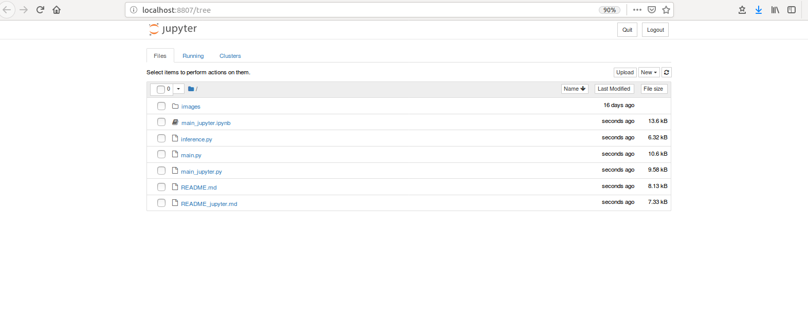
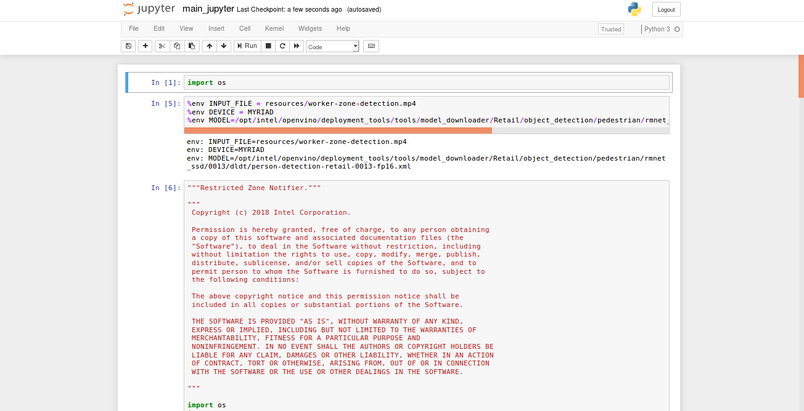

# Restricted Zone Notifier

| Details            |              |
|-----------------------|---------------|
| Target OS:            |  Ubuntu\* 16.04 LTS   |
| Programming Language: |  Python* 3.5 |
| Time to Complete:    |  30 min     |


## Introduction

This restricted zone notifier application uses the Inference Engine included in the Intel® Distribution of OpenVINO™ toolkit and the Intel® Deep Learning Deployment Toolkit. A trained neural network detects people within a marked assembly area, which is designed for a machine mounted camera system. It sends an alert if there is at least one person detected in the marked assembly area. The user can select the area coordinates either via command line parameters, or once the application has been started, they can select the region of interest (ROI) by pressing `c` key. This will pause the application, pop up a separate window on which the user can drag the mouse from the upper left ROI corner to whatever the size they require the area to cover. By default the whole frame is selected. Worker safety and alert signal data are sent to a local web server using the Paho MQTT C client libraries.

This sample is intended to demonstrate how to use Inference Engine included in the Intel® Distribution of OpenVINO™ toolkit and the Intel® Deep Learning Deployment Toolkit to improve assembly line safety for human operators and factory workers.

The DNN model used in this application is an Intel® optimized model that is part of the Intel® Distribution of OpenVINO™ toolkit. You can find it here:

 `/opt/intel/computer_vision_sdk_2018.5.445/deployment_tools/intel_models/person-detection-retail-0013`

The program creates two threads for concurrency:

- Main thread that performs the video i/o, processes video frames using the trained neural network.
- Worker thread that publishes MQTT messages.


## Requirements

### Hardware

* 6th to 8th generation Intel® Core™ processor with Iris® Pro graphics or Intel® HD Graphics
 
### Software

* [Ubuntu\* 16.04 LTS](http://releases.ubuntu.com/16.04/)

* OpenCL™ Runtime package

  *Note*: We recommend using a 4.14+ kernel to use this software. Run the following command to determine your kernel version:
  ```
    uname -a
  ```

* Intel® Distribution of OpenVINO™ toolkit 2018 R5 release toolkit

## Setup

### Install Intel® Distribution of OpenVINO™ toolkit

Refer to https://software.intel.com/en-us/articles/OpenVINO-Install-Linux for more information about how to install and setup the Intel® Distribution of OpenVINO™ toolkit.

You will need the OpenCL™ Runtime package if you plan to run inference on the GPU. It is not mandatory for CPU inference.

### Install Python* dependencies

 ```sudo apt install python3-pip```

 ```sudo apt-get install mosquitto mosquitto-clients```

 ```pip3 install paho-mqtt```

 ```pip3 install numpy```

 ```pip3 install jupyter```

 
## Setup the environment

You must configure the environment to use the Intel® Distribution of OpenVINO™ toolkit one time per session by running the following command:
```
source /opt/intel/computer_vision_sdk_2018.5.445/bin/setupvars.sh -pyver 3.5
```

## Run the code on Jupyter*

* Open the terminal, change the current directory to the git-cloned application code location on your system.
```
    cd <path_to_the_restricted-zone-notifyer-python_directory>
```
* To open the Jupyter notebook, run the following command.
```
    jupyter notebook
```

**Follow the steps to run the code on Jupyter:**



1. Click on **New** button on the right side of the Jupyter window.

2. Click on **Python 3** option from the drop down list.

3. In the first cell type **import os** and press **Shift+Enter** from the keyboard.

4. Export the below environment variables in second cell of Jupyter and press **Shift+Enter**.<br>
    %env INPUT_FILE = resources/worker-zone-detection.mp4 <br>
    %env CPU_EXTENSION = /opt/intel/computer_vision_sdk_2018.5.445/inference_engine/lib/ubuntu_16.04/intel64/libcpu_extension_sse4.so <br>
    %env MODEL=/opt/intel/computer_vision_sdk_2018.5.445/deployment_tools/intel_models/person-detection-retail-0013/FP32/person-detection-retail-0013.xml <br>
    
5. User can set threshold for the detection (PROB_THRESHOLD), target device to infer on (DEVICE),
   number of seconds between data updates to MQTT server (RATE), also "off-limits" area coordinates (POINTX, POINTY, WIDTH, HEIGHT)
   . Export these environment variables as given below if required else skip this step. If user skips this step, these values are set to default values.<br>
   %env PROB_THRESHOLD = 0.4 <br>
   %env DEVICE = CPU <br>
   %env RATE = 1.00 <br>
   %env POINTX = 429 <br>
   %env POINTY = 101 <br>
   %env WIDTH = 619 <br>
   %env HEIGHT = 690 <br>
   
6.  Copy the code from **main_jupyter.py** and paste it in the next cell and press **Shift+Enter**.

7.  Once the video runs, user can select an area to be used as the "off-limits" area by pressing the `c` key. A new window will open showing a still image from the video capture device. Drag the mouse from top left corner to cover an area on the plane and once done (a blue rectangle is drawn) press `ENTER` or `SPACE` to proceed with monitoring.

8. Alternatively, code can be run in the following way.

    i. Click on the **main_jupyter.ipynb** file in the Jupyter notebook window.
    
    ii. Click on the **Kernel** menu and then select **Restart & Run All** from the drop down list.
    
    iii. Click on Restart and Run All Cells.


**NOTE:**

1. To run the application on **GPU**:
     * Change the **%env DEVICE = CPU** to **%env DEVICE = GPU**.
     * With the floating point precision 16 (FP16), change the path of the model in the environment variable as given below:<br>
        **%env MODEL=/opt/intel/computer_vision_sdk_2018.5.445/deployment_tools/intel_models/person-detection-retail-0013/FP16/person-detection-retail-0013.xml**.
     * **CPU_EXTENSION** environment variable is not required.
   
2. To run the application on **Intel® Neural Compute Stick**: 
      * Change the **%env DEVICE = CPU** to **%env DEVICE = MYRIAD**.  
      * The Intel® Neural Compute Stick can only run FP16 models. Hence change the environment variable for the model as shown below. <br>
      **%env MODEL=/opt/intel/computer_vision_sdk_2018.5.445/deployment_tools/intel_models/person-detection-retail-0013/FP16/person-detection-retail-0013.xml**.
      * **CPU_EXTENSION** environment variable is not required.

3.  To run the application using **camera stream**, change the **%env INPUT_FILE = resources/worker-zone-detection.mp4** to  **%env INPUT_FILE = cam**.<br>
4. **%env RATE** should always have float values (e.g. 0.02, 1.00, etc.,).

## Machine to Machine Messaging with MQTT

If you wish to use a MQTT server to publish data, you should set the following environment variables on a terminal before running the program:
```
export MQTT_SERVER=localhost:1883
export MQTT_CLIENT_ID=cvservice
```

Change the `MQTT_SERVER` to a value that matches the MQTT server you are connecting to.

You should change the `MQTT_CLIENT_ID` to a unique value for each monitoring station, so that you can track the data for individual locations. For example:
```
export MQTT_CLIENT_ID=zone1337
```

If you want to monitor the MQTT messages sent to your local server, and you have the `mosquitto` client utilities installed, you can run the following command in a new terminal while executing the code:
```
mosquitto_sub -h localhost -t Restricted_zone_python
```
